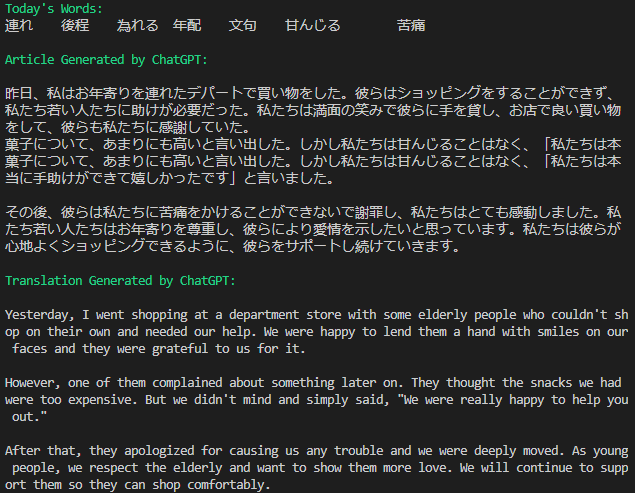

# Anki Quick AI

The Anki Quick AI Addon is a powerful tool that lets you interact with OpenAI in Anki. It allows you to find and collect field values from notes, interact with OpenAI using customized prompts in multiple languages, and generate and play audio responses.

The process is:
1. Find & collect field values from Anki's notes.
2. Interact with OpenAI using custom prompts. Multiple interactions & languages supported.
3. Generate & play audio responses from OpenAI.


## Example Usage

1. Words story: Retrieve words studied today in Anki, and send them to OpenAI to asks it make a story using these words. Print the story and generate the audio files.

https://github.com/chuanqixu/anki-quick-ai/assets/33219261/a383cd74-e915-489c-adcb-a770cf8dd2ba

# Usage

You can use both Anki add-on or Python locally (Local version is not maintained now).

## Anki Add-On (Developing)

### Install

It has been submitted to Anki add-ons [Anki Quick AI](https://ankiweb.net/shared/info/547821970). The code is **547821970**.

To install it, click "Tools->Add-ons->Get Add-ons". In the Code section, input **547821970**, and then click OK.

### Settings

Double click "Tools->Add-ons->Anki Quick AI", and a config page with json data format will show.

1. api_key: API key for OpenAI.
2. model: OpenAI model to be used in this addon.
3. query: Query used to search for notes. The query grammar is the same as Anki browse, which can be found in the (manual)(https://docs.ankiweb.net/searching.html).
4. note_field: The field whose values will be used to replace {response} placeholder in `prompt_list`. The note field can be found in "Browse->Note Types".
5. prompt_list: A list of prompts that will be sent to OpenAI. In the prompt, you can use two placeholders, which will be replaced before sending to OpenAI.
   1. {language}: This will be replaced with the language you set in `language_list`. The index of prompt is the same as the index of the language in `language_list`.
   2. {response}: In the first prompt, this will be replaced with a list of strings, which are values of the `note_field` in notes searched by `query`. In other prompts, this will be replaced with the previous response from OpenAI.
6. language_list: A list of language for each response. This will be replaced if you set {language} placeholder in `prompt_list`. The length should be the same as `prompt_list`
7. play_sound: Whether to use [edge-tts](https://github.com/rany2/edge-tts) to generate the sound of the response from OpenAI.
8. automatic_display: Whether to automatic show the window choosing whether to run the addon when changing to the main page.


### Usage

Click the `Tools->` button on the menu bar in the main Anki window, and then click `AI Quick AI`. Wait for seconds for AI generation and transmission between OpenAI and your local machine. If you also generate the sound, then it may take another seconds for sound generation.


### Setup (Optional)

[add-on/lib](add-on/lib/) contains third-party libraries that are not supported by Anki. Currently, Anki add-ons require third-party libraries to be bundled with the source code.

Update third-party libraries:
```bash
cd add-on
pip install -r requirements.txt --target lib
```

## Local Usage

Local usage is not maintained. Please use the Add-on version.

One example for local usage:


### Setup

1. The program is connected with Anki through [Anki-Connect](https://github.com/FooSoft/anki-connect). First, install Anki-Connect add-on for your Anki.

2. Install requirements:

    ```
    pip install -r requirements.txt
    ```

3. Edit environment variables in `./src/.env`:

   1. Copy the example file:

        ```
        cp .env_example .env
        ```
    
    2. Input your settings. Delete all empty variables, which will be replaced with default values in the `src/configure.py`.

4. (Advanced) Customize words: specify `query` in `src/.env`. The query grammar is the same as Anki browse, which can be found in the (manual)(https://docs.ankiweb.net/searching.html).

### Usage

1. Run the program. Make sure Anki is running for Anki-Connection:

    ```
    python src/gpt.py
    ```

2. The information is generated in the terminal, and the sound generated by [edge-tts](https://github.com/rany2/edge-tts) is automatically played. In addition, two .mp3 files are generated. `output/article.mp3` is the audio file for the original article. `output/translated_article.mp3` is the audio file for the translation.


# Acknowledgement

Thanks for the inspiration and code in [yihong0618/duolingo_remember](https://github.com/yihong0618/duolingo_remember) and [yihong0618/shanbay_remember](https://github.com/yihong0618/shanbay_remember).

